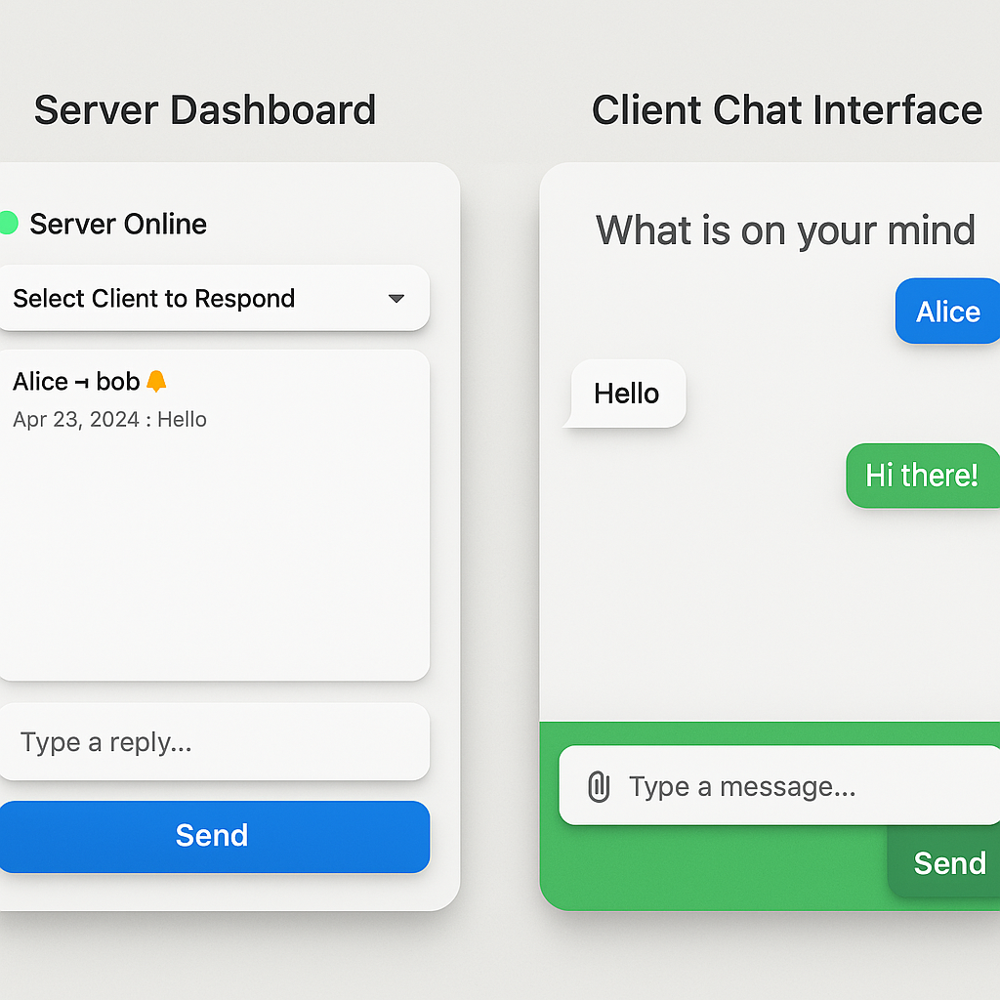

# 💬 Real-Time Customer Support Chat System


---


## 📘 Overview

A sleek, full-stack customer support chat system built in Python using Flet for the interactive UI and `websockets` for real-time communication. The server handles client sessions, database persistence, and multi-user support dashboards. The client connects securely using session tokens, supports media messages, and offers a responsive chatroom interface.

---

## 🧱 Architecture


- **Server UI**: Admin dashboard to interact with clients
- **Client UI**: Chatroom-style messenger with multimedia features
- **WebSocket Layer**: Enables real-time bidirectional communication
- **SQLite Databases**:
  - `chat_messages.db` stores all messages
  - `session_tokens.db` verifies session credentials

---

## 🧑‍💻 Client-Side Features

- 🔐 Launch with `username` & `session_token`
- 💬 Real-time messaging with server
- 📎 FilePicker for image, audio, video, and other files
- 🖼 Inline media rendering in chat
- 🎨 Styled UI with gradients, shadows, and aligned messages
- 🛡 Server message fallback formatting
- 🌐 Runs as:  
  ```bash
  python client_app.py johndoe abc123token

  🧠 Server-Side Features
🛡 Session token validation on connect
🎛 Live dropdown of connected clients with pending notification indicator
🗃 Persistent message storage in chat_messages.db
📡 Real-time server-to-client message dispatch
📜 Admin interface to view history and respond
🔔 Queued messages and alerting badge system

📦 Setup

Install dependencies:
bash
pip install flet websockets

Launch the server:
bash
python server_app.py

Launch the client:
bash
python client_app.py username session_token

🧪 Testing Flow
Start server and keep UI open
Run multiple clients with unique session tokens
Send and receive message
Share media: images, audio, video
Review history and swap sessions on server dashboard

🔐 Token Storage

The server uses session_tokens.db to store valid user tokens:
sql
CREATE TABLE Sessions (
    id INTEGER PRIMARY KEY,
    username TEXT NOT NULL,
    session_token TEXT NOT NULL
);
Session tokens must be created manually or via a management interface.

🚀 Next Improvements

📬 Sync full chat history on client side
🪪 In-app session management for login/logout
🤝 Group chat or broadcast mode
🔗 Support external storage for media
🎨 Custom themes and avatars

👨‍💻 Author
Crafted by Reginald 📫 chiprobook@hotmail.com
